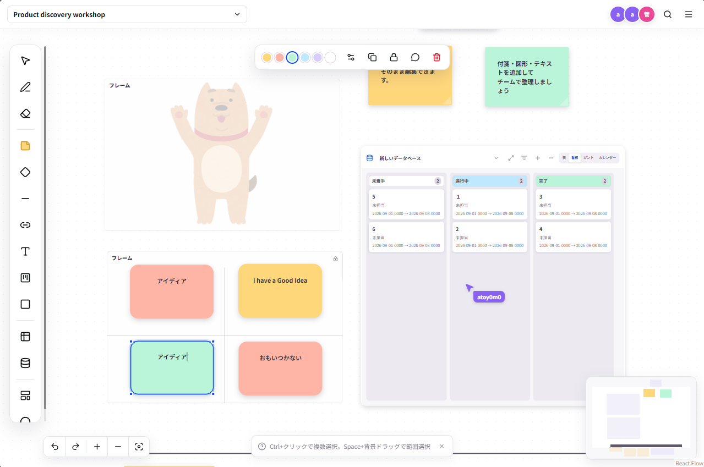

# れんらくがかり

人とAIが同じボードを共同編集できる、セルフホスト型のホワイトボードです。付箋、図形、テキスト、フレーム、データベース、コメント、タイマーをブラウザから操作できます。AIエージェントはMCP経由で同じボードへ参加できます。



## 必要環境

- Node.js 24以上
- npm

SQLiteはNode.js組み込み版を使用するため、別途データベースを用意する必要はありません。

## 起動

```powershell
npm ci
Copy-Item .env.example .env.local
npm run dev
```

`.env.local`の初期管理者情報を変更してから起動してください。

```dotenv
RENRAKU_BOOTSTRAP_ADDRESS=owner@example.com
RENRAKU_BOOTSTRAP_DISPLAY_NAME=管理者
RENRAKU_BOOTSTRAP_PASSWORD=replace-with-a-long-random-password
COLLAB_SERVICE_TOKEN=replace-with-a-long-random-token
MINGLEBOARD_COLLAB_TOKEN=replace-with-the-same-collaboration-service-token
```

- Web画面: `http://localhost:3010/`
- 共同編集サーバー: `ws://localhost:1234`

初回起動時、ユーザーが一人も登録されていない場合だけ、上記の値から管理者を作成します。以後のユーザー招待は管理者画面で行います。

## ユーザー管理

- ログインIDはメールアドレスです。
- `/admin`は管理者だけが利用できます。
- 招待時の表示名はメールアドレスの`@`より前を初期値にします。
- 招待時の初期パスワードは`password`で、管理者が変更できます。
- 招待されたユーザーは初回ログイン時に12文字以上のパスワードへ変更するまで、ボードと管理APIを利用できません。
- 管理者権限は招待時にも、招待後にも付与・解除できます。
- パスワード変更には現在のパスワードが必要です。変更すると既存セッションは失効し、操作中の端末だけ新しいセッションへ切り替わります。
- ログイン失敗はアドレス単位で記録し、15分以内に5回失敗すると15分間ログインを制限します。

## MCP接続

共同編集サーバーを起動した状態で、MCPクライアントから`mcp-server.mjs`を実行します。設定例は[mcp-config.example.json](./mcp-config.example.json)にあります。

`MINGLEBOARD_COLLAB_TOKEN`には共同編集サーバー側の`COLLAB_SERVICE_TOKEN`と同じ、十分に長いランダム値を設定してください。ローカル起動では`.env.local`から両方を読み込みます。この値はAIエージェント用の共有サービス資格情報です。リポジトリへコミットせず、利用者ごとに安全な方法で配布してください。

```powershell
npm run mcp
```

MCPサーバーは、ボード、オブジェクト、接続線、コメント、データベース、タイマーを扱う39個の操作を公開します。接続先やエージェント表示は次の環境変数で変更できます。

| 変数 | 既定値 |
| --- | --- |
| `MINGLEBOARD_ROOM` | `product-discovery` |
| `MINGLEBOARD_COLLAB_URL` | `ws://localhost:1234` |
| `MINGLEBOARD_COLLAB_TOKEN` | 必須（`COLLAB_SERVICE_TOKEN`と同じ値） |
| `MINGLEBOARD_AGENT_OWNER` | `所有者未設定` |
| `MINGLEBOARD_AGENT_NAME` | `AI Agent` |
| `MINGLEBOARD_AGENT_ID` | 起動時に生成 |
| `MINGLEBOARD_AGENT_COLOR` | `#7c3aed` |

## データ

ボード、データベース、ユーザー、セッションは`data/mingleboard.sqlite`へ保存されます。`data/`はGit追跡対象外です。バックアップ時はアプリを停止し、SQLite本体と同じ場所にあるWAL関連ファイルをまとめて保存してください。

## 本番ビルド

```powershell
npm run build
npm start
```

## Docker

DockerとDocker ComposeはWSL内で実行してください。初期管理者のメールアドレス、初期パスワード、共同編集サービス用トークンは必須です。既知の既定値では起動しません。

```bash
export RENRAKU_BOOTSTRAP_ADDRESS=owner@example.com
export RENRAKU_BOOTSTRAP_DISPLAY_NAME=管理者
export RENRAKU_BOOTSTRAP_PASSWORD='replace-with-a-long-password'
export COLLAB_SERVICE_TOKEN="$(openssl rand -base64 48)"
docker compose up --build -d
```

既定ではWeb画面と共同編集ポートを`127.0.0.1`だけに公開します。インターネットへ公開する場合は、TLS対応のリバースプロキシからWeb画面へ接続し、共同編集も同じ公開先の`wss://` URLへ中継してください。共同編集ポート`1234`をインターネットへ直接公開しないでください。

別端末からアクセスさせる場合は、ビルド前に`NEXT_PUBLIC_COLLAB_URL`へブラウザから到達できるWebSocket URL（例: `wss://board.example.com/collab`）を指定します。ローカル利用では既定の`ws://localhost:1234`を使用できます。

MCPをDockerホストから使う場合は、起動時と同じトークンをMCPプロセスへ渡します。

```bash
export MINGLEBOARD_COLLAB_TOKEN="$COLLAB_SERVICE_TOKEN"
npm run mcp
```

状態確認と停止は次のコマンドで行います。SQLiteデータは`app-data`ボリュームに残ります。

```bash
docker compose ps
docker compose down
```

## ライセンス

ソースコードは[MIT License](./LICENSE)で提供します。`public/fonts/noto-sans-jp/`のフォントは同ディレクトリの`OFL.txt`に従います。
